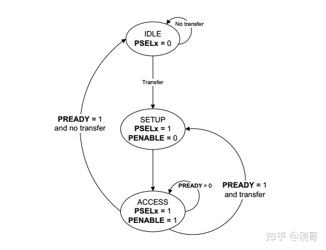

# 信号

| 信号        | 来源             | 宽度            | 描述                                                         |
| ----------- | ---------------- | --------------- | ------------------------------------------------------------ |
| **PCLK**    | clock            | 1               | 时钟.PCLK是一个时钟信号。所有的APB信号是在PCLK的上升沿计时。 |
| **PRESETn** | System bus reset | 1               | 复位.PRESETn是一个复位信号，是active low.PRESETn通常是连接到系统总线的复位信号。 |
| **PADDR**   | Requester        | ADDR_WIDTH      | 地址.PADDR是APB的地址信号。PADDR最大到达32bit。              |
| PPROT       | Requester        | 3               | 保护类型。PPROT表明事务的正常，优先或安全保护的等级，事务是否是一个数据访问或指令访问。参阅Protection unit support on page 3-27 |
| **PSELx**   | Requester        | 1               | 选择。请求者为每一个完成者生成一个PSELx信号。PSELx表明完成者被选择并且一个数据传输被请求。 |
| **PENABLE** | Requester        | 1               | 使能。PENABLE表明APB传输第二个或后续的周期。                 |
| **PWRITE**  | Requester        | 1               | 方向。PWRITE为高表明APB写访问，为低表明APB读访问。           |
| **PWDATA**  | Requester        | DATA_WIDTH      | 写数据。当PWRITE是高时，PWDATA写数据总线在写周期被APB桥请求者驱动。PWDATA是8bit，16bit和32bit位宽。 |
| PSTRB       | Requester        | DATA_WIDTH/8    | 写选通。PSTRB表明在写传输时，那一个字节通道更新。写数据总线的每8bit有一个写选通。PSTRB[n]对应PWDATA[(8n + 7):(8n)]. PSTRB在读传输期间不能是active。 |
| **PREADY**  | Completer        | 1               | 准备。PREADY被完成者用来扩展一个APB传输。                    |
| **PRDATA**  | Completer        | 1               | 读数据。当PWRITE为低，在读期间，PRDATA读数据总线被选中的完成者驱动。PRDATA可以是8bit，16bit和32bit。 |
| PSLVERR     | Completer        | 1               | 传输错误。PSLVERR是一个可选择的信号，被完成者置为高从而来表明一个APB传输错误的情形。参阅Error response on page 3-25 |
| PWAKEUP     | Requester        | 1               | 唤醒。PWAKEUP表明与APB接口的任何活动。参阅Wake-up signaling on page 3-28. |
| PAUSER      | Requester        | USER_REQ_WIDTH  | 用户请求属性。PAUSER的最大宽度建议为128bit。参阅User signaling on page 3-29 |
| PWUSER      | Requester        | USER_DATA_WIDTH | 用户写数据属性。PWUSER的最大宽度建议为DATA_WIDTH/2。参阅User signaling on page 3-29 |
| PRUSER      | Completer        | USER_DATA_WIDTH | 用户读数据属性。PRUSER的最大宽度建议为DATA_WIDTH/2。参阅User signaling on page 3-29 |
| PBUSER      | Completer        | USER_RESP_WIDHT | 用户响应属性。PBUSER的最大宽度建议为16bit。                  |

# 状态机

- **IDLE** ：APB的默认状态，此时没有数据传输，PSEL,PENABLE均为default 0
- **SETUP**：当需要进行一个传输的时候，APB 首先进入这个状态；PSELx 信号首先拉高；总线仅仅在 SETUP 状态停留一个时钟周期，然后接着在下一个时钟的上升沿进入 ACCESS 状态；
- **ACESS**：在 SETUP 状态转换到 ACCESS，PENABLE 信号被拉高；在 SETUP 状态转换到 ACCESS 状态这段时间里，address，write，select 和 write data 信号必须保持稳定；

# 时序图

## with no wait states

T1 时刻 ：在PCLK的上升沿，APB 将地址信息 PADDR 和数据 PWDATA 准备好，拉高 PWRITE 表示进入写，同时拉高 PSEL，从 IDLE 进入 SETUP

T2 时刻：也就是下一个时钟周期拉高 PENABLE，表示开始进行数据传输，状态进入 ACCESS

T3 时刻：检测到 PREADY 被拉高，也就是说 Slave 已经正确接收到数据，传输完成；PENABLE 拉低，PSEL 拉低 。

一直到T3时刻所有数据传输完成之前所有的信号PADDR,PWDATA以及控制信号需要保持不变。

T1 时刻 ：在PCLK的上升沿，APB 将地址信息 PADDR ，此时 PWRITE 为低表示读操作，同时拉高 PSEL，从 IDLE 进入 SETUP

T2 时刻：也就是下一个时钟周期拉高 PENABLE，表示开始进行数据传输，状态进入 ACCESS

T3 时刻：检测到 PREADY 被拉高，也就是说 Slave 已经将PRDATA准备好，MASTER可以接收SLAVE的数据，然后PENABLE 拉低，PSEL 拉低 。

读操作是SLAVE将准备好的数据放到PRDATA总线上，然后通过PREADY通知MASTER。

注意：slave需要在T2时刻将需要读取的数据准备好

## with wait states

slave可以通过pready拉低，来延长slave的响应时间。此时需要注意，**其他信号需要保持不变**。

## Error response

APB协议可以通过PSLVERR信号表示对应传输错误。只不过在APB协议中error只有1 bit表示所有的错误。具体的协议实现如下：

需要注意的是，**PSLVERR是与ready信号同时返回的**，只有这样master才能正确采样到错误信号。在salve内部处理之前需要将ready拉低以等待内部检测是否有错误发生。

# APB新增属性

## **Protection transaction**

PPROT可实现APB传输的保护控制。PPROT[0]表示不同优先级的传输，可实现salve对不通优先级数据的特殊处理操作。PPROT[1]表示对不同安全属性的数据传输，对Secure和Non-secure的数据进行数据处理，Non-secure不能更改secure属性的区域。PPROT[2]用来指数此时传输是数据传输还是指令传输。

APB的这个升级是集成的AHB与AXI的属性，也是为了更加符合现在系统设计的需求。

## **PWAKEUP SIGNAL**

PWAKEUP用来指示本次传输是否有效，是随请求信号一块传输的。

设计上如果我们端口又pwakeup信号就一定要在传输的时候使能pwakeup信号，如果传输的时候pwakeup信号不使能，则slave会认为这一笔数据传输无效。

**设计上建议pwakeup信号跟psel一块拉高或者先于psel拉高**。也可以用pwakeup控制apb的时钟达到低功耗的目的。

## **USER SIGNAL**

APB信号增加了USER信号，可针对地址，读写数据，响应增加USER信号，可以用来传输用户自定信号，增加协议的灵活性。

信号的有无，以及位宽可以用户自定义。

## **PARITY protection**

在最新的APB协议中，增加了对协议的parity保护，可以针对地址，数据以及控制信号的保护传输。在Source侧可以针对要传输的信号增加parity generation模块产生校验码，同时也可以对返回的数据进行校验。在Destination侧可以增加Parity check模块对Source侧传过来的数据与校验码进行校验，从而覆盖从Source到Destination的整个通路的安全保护，试下端到端(E2E)的保护机制。

**具体的实现机制与奇偶校验都可以自行选择实现**。