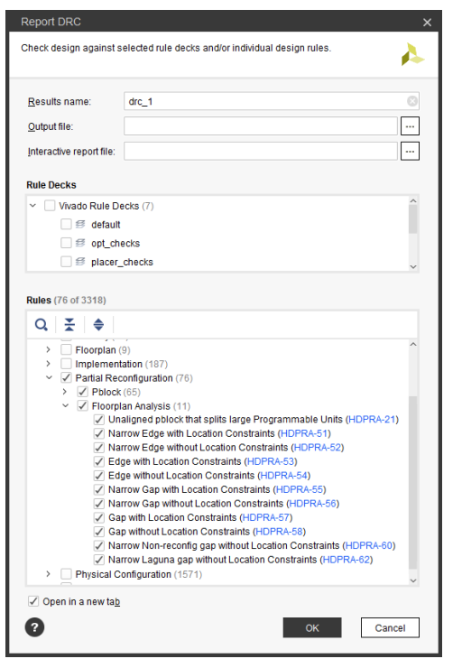

# 步骤1：netlist生成

需要系统总体（top层）的dcp和各RM(reconfigure module)的dcp文件。其中顶层dcp生成时，吃的各RM的RTL为**只含有端口信息设为wrapper文件，即在顶层综合时把各子模块做成blackbox**。

需要注意的是，rm模块综合时为了避免插入不必要的ibuf，需要使用OOC综合：

```tcl
 if {$topLevel} {
      command "synth_design -mode default $options -top $moduleName -part $part" "$resultDir/${moduleName}_synth_design.rds"
 } else {
      command "synth_design -mode out_of_context $options -top $moduleName -part $part" "$resultDir/${moduleName}_synth_design.rds"
 }
```


把top模块和各rm模块的综合结果保存为dcp文件：

```tcl
 command "write_checkpoint -force $resultDir/${moduleName}_synth.dcp" "$resultDir/write_checkpoint.log"
```


# 步骤2：link design

把步骤1中的top dcp和其中**一组rm模块**吃进prj做link。把rm的dcp绑定到top层的inst上。

```tcl
set_property SCOPED_TO_CELLS {inst_shift (path 1)} [get_files ./Synth/shift_right/shift_synth.dcp]
```

命令中path1是指该rm模块在top中的Hierarchy Path，后面的get_files是该rm dcp文件的路径。

项目中有多少rm模块就执行多少次。


这些完成后，执行link。此时也需要通过 *-reconfig_partitions {inst_shift inst_count}* 指定所有rm的模块Hierarchy。

```tcl
link_design -mode default -reconfig_partitions {inst_shift inst_count} -part $part -top top
```


这步完成后，就获得了一个完整的dcp文件。可以通过write_checkpoint 将其保存。


# 步骤3：划分floorplan

在gui界面上为各rm模块划分floorplan。具体操作步骤：

> Select the inst_count instance in the Netlist pane. Right-click and select Floorplanning > Draw Pblock, or select the Draw Pblock toolbar button , and draw a tall narrow box on the left side of the X0Y3 clock region. The exact size and shape do not matter at this point, but keep the box within the clock region.

**需要注意的是，pblock中的资源一定要大于该rm模块需要的资源数量。**

在pblock选中后，需要在pblock 的**RESET_AFTER_RECONFIG**中，打开**RESET_AFTER_RECONFIG**，把 SNAPPING_MODE 改为 ROUTING 。

在所有的rm都分玩pblock后，需要通过report drc命令，检查pblock是否满足partial reconfiguration的需求。





在完成drc检查后，可以将xdc进行保存，该xdc中包含了刚才的那些pblock的信息。

```tcl
write_xdc ./Sources/xdc/top_all.xdc
```


# 步骤4：综合

opt_design

place_design

route_design

来对上述工程进行一轮完整的综合。

```tcl
write_checkpoint -force Implement/Config_shift_right_count_up_implement/top_route_design.dcp
```


# 步骤5：静态dcp保存

对于上述的dcp，重新将各RM模块挖空成blackbox。

```tcl
update_design -cell inst_shift -black_box
```

其中，inst_shift是rm模块的Hierarchy。

完成后，dcp中只省下非rm部分了，此时锁定设计（锁定非rm部分**布局布线**的结果）。

```tcl
lock_design -level routing
```


将锁定后的dcp保存，此即为项目中非rm部分的布局布线结果。

```tcl
write_checkpoint -force Checkpoint/static_route_design.dcp
```


# 步骤6：RM重用实现

对于rm模块新的实现时，只需要重复步骤2中的link design。只不过对于步骤2中的top层dcp文件更换为步骤5中生成的静态dcp文件。接着，直接重复步骤4，即可完成RM。


# 参考：

1. https://docs.xilinx.com/v/u/2018.3-English/ug947-vivado-partial-reconfiguration-tutorial

2. 具体脚本见ug947中的示例